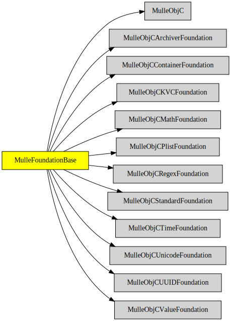

# MulleFoundationBase

#### 🛸 MulleFoundationBase does something

This is an almagamation of the MulleFoundation libraries that do not 
depend on platform specific code (below MulleObjCOSFoundation),
See the [constituting projects](#Constituents) for documentation, 
bug reports, pull requests.

The advantages of **MulleFoundationBase** are:

* compiles faster than almost a dozen individual projects
* you only need to link against one library file
* `#import` statements of the individual libraries can remain unchanged or cab be simplified to `#import <MulleFoundationBase/MulleFoundationBase.h>`


| Release Version                                       | Release Notes
|-------------------------------------------------------|--------------
|  [](//github.com//MulleFoundationBase/actions)| [RELEASENOTES](RELEASENOTES.md) |


## Requirements

|   Requirement         | Release Version  | Description
|-----------------------|------------------|---------------
| [MulleObjC](https://github.com/mulle-objc/MulleObjC) |  [](https://github.com///actions/workflows/mulle-sde-ci.yml) | 
| [mulle-objc-list](https://github.com/mulle-objc/mulle-objc-list) |  [](https://github.com///actions/workflows/mulle-sde-ci.yml) | 

### You are here



## Add

Use [mulle-sde](//github.com/mulle-sde) to add MulleFoundationBase to your project:

``` sh
mulle-sde add github:MulleFoundation/MulleFoundationBase
```

## Install

### Install with mulle-sde

Use [mulle-sde](//github.com/mulle-sde) to build and install MulleFoundationBase and all dependencies:

``` sh
mulle-sde install --prefix /usr/local \
   https://github.com/MulleFoundation/MulleFoundationBase/archive/latest.tar.gz
```

### Manual Installation

Install the requirements:

| Requirements                                 | Description
|----------------------------------------------|-----------------------
| [MulleObjC](https://github.com/mulle-objc/MulleObjC)             | 
| [mulle-objc-list](https://github.com/mulle-objc/mulle-objc-list)             | 

Download the latest [tar](https://github.com/MulleFoundation/MulleFoundationBase/archive/refs/tags/latest.tar.gz) or [zip](https://github.com/MulleFoundation/MulleFoundationBase/archive/refs/tags/latest.zip) archive and unpack it.

Install **MulleFoundationBase** into `/usr/local` with [cmake](https://cmake.org):

``` sh
cmake -B build \
      -DCMAKE_INSTALL_PREFIX=/usr/local \
      -DCMAKE_PREFIX_PATH=/usr/local \
      -DCMAKE_BUILD_TYPE=Release &&
cmake --build build --config Release &&
cmake --install build --config Release
```

## Author

[Nat!](https://mulle-kybernetik.com/weblog) for Mulle kybernetiK


